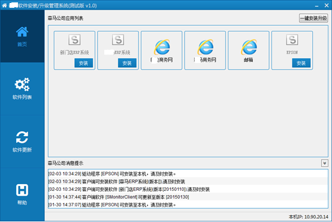
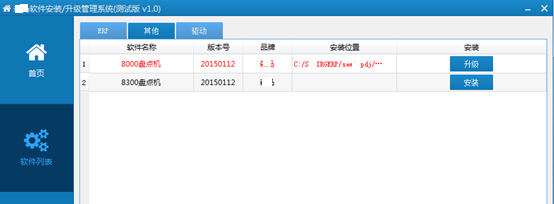
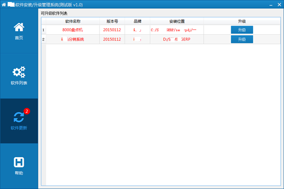
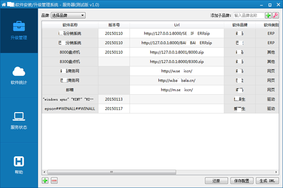
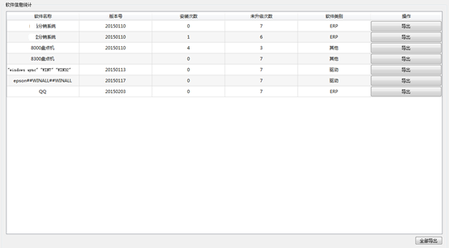

# Software Monitor: An Enterprise software asset deployment and management tool
## Basic features
SMonitor is a server/clients enterprise software asset deployment and management tool. Easily help the IT engineer managements all the PCs in company domain and outside company domain.  SMonitor can be used for monitor all the PC clients software installation. Deploy software to the end points and monitor the PCs
##  Client Configuration
Please change the configure.ini in root directory of client
e.g
[ServerInfo]
ServerIP=201.130.40.236
ServerPort=14640
HostName=yourserver.domain.com
### Main interface of client

### Software List

###Software Upgade

#Server Usage
## configure.ini configure
[Server]
UpdateXml=http://127.0.0.1:8000/update.xml
HelpInfoXml=http://127.0.0.1:8000/help.xml
VersionCheckFile=http://127.0.0.1:8000/SMonitorClientVersion.txt
ListenPort=14640
MaxClientsNum=-1
[Passwd]
CompanyName=AAAABXicK85NK88GAAaDAik=
##Server main interface

##Software installation status

